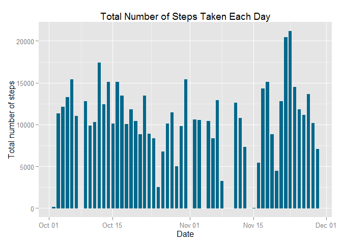
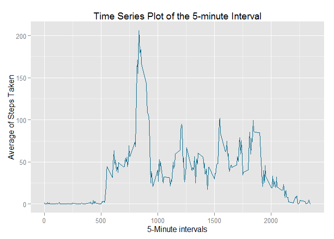
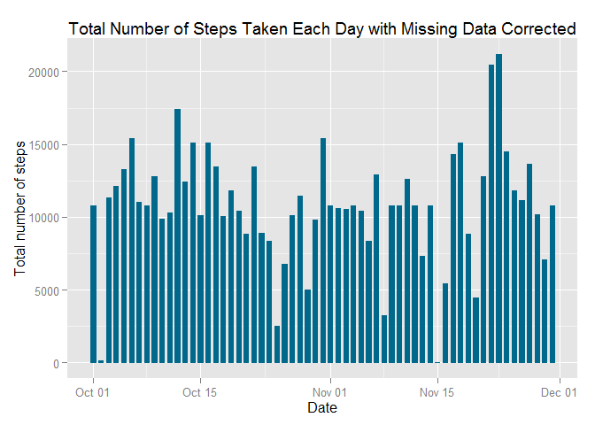

# Reproducible Research: Peer Assessment 1
Yuyong He  

### Introdution

Based on the requirements of peer assessment 1 for Reproducible Research course,
the solutions are as below.

### Assumption

It's assumed that data have been unzipped from activity.zip file into the working directory.

### Setting Global Options

```r
## My Windows OS is Chinese version, So set local to English
Sys.setlocale("LC_TIME", "English") 
```

```
## [1] "English_United States.1252"
```

```r
echo = TRUE
options(scipen = 1)  # Turn off scientific notations for numbers display.
```

### Loading and processing the data

```r
data <- read.csv("activity.csv", colClasses = c("integer", "Date", "factor"))
data_noNA <- na.omit(data)

## Preview clean data
head(data_noNA)
```

```
##     steps       date interval
## 289     0 2012-10-02        0
## 290     0 2012-10-02        5
## 291     0 2012-10-02       10
## 292     0 2012-10-02       15
## 293     0 2012-10-02       20
## 294     0 2012-10-02       25
```

```r
dim(data_noNA)
```

```
## [1] 15264     3
```


### What is mean total number of steps taken per day?

1. Calculate the total number of steps taken per day.


```r
result1 <- with(data_noNA, aggregate(steps, by = list(date), FUN = sum))

## Change columns' names.
names(result1)[1] <- "date"
names(result1)[2] <- "steps"

head(result1)
```

```
##         date steps
## 1 2012-10-02   126
## 2 2012-10-03 11352
## 3 2012-10-04 12116
## 4 2012-10-05 13294
## 5 2012-10-06 15420
## 6 2012-10-07 11015
```

2. Make a histogram of the total number of steps taken each day.


```r
library(ggplot2)
```

```
## Warning: package 'ggplot2' was built under R version 3.1.3
```

```r
ggplot(result1, aes(date, steps)) + geom_histogram(stat = "identity", colour = "deepskyblue4", fill = "deepskyblue4", width = 0.6) + labs(title = "Total Number of Steps Taken Each Day") + labs(x = "Date", y = "Total number of steps")
```

 

3. Calculate and report the mean and median of the total number of steps taken per day.

* Mean of the total number of steps taken per day:

```r
meanOfTotalStepsPerDay <- mean(result1$steps)
meanOfTotalStepsPerDay
```

```
## [1] 10766.19
```

* Median of the total number of steps taken per day:

```r
medianOfTotalStepsPerDay <- median(result1$steps)
medianOfTotalStepsPerDay
```

```
## [1] 10765
```

### What is the average daily activity pattern?
1. Make a time series plot (i.e. type = "l") of the 5-minute interval (x-axis) and the average number of steps taken, averaged across all days (y-axis).


```r
result2 <- with(data_noNA, aggregate(steps, by = list(as.numeric(as.character(interval))), FUN = mean))

### Change columns' names.
names(result2)[1] <- "interval"
names(result2)[2] <- "meanOfSteps"

head(result2)
```

```
##   interval meanOfSteps
## 1        0   1.7169811
## 2        5   0.3396226
## 3       10   0.1320755
## 4       15   0.1509434
## 5       20   0.0754717
## 6       25   2.0943396
```

```r
ggplot(result2, aes(interval, meanOfSteps)) + geom_line(color = "deepskyblue4", size = 0.6) + labs(title = "Time Series Plot of the 5-minute Interval") + labs(x = "5-Minute intervals", y = "Average of Steps Taken")
```

 

2. Which 5-minute interval, on average across all the days in the dataset, contains the maximum number of steps?


```r
result2[result2$meanOfSteps == max(result2$meanOfSteps), ]
```

```
##     interval meanOfSteps
## 104      835    206.1698
```

### Imputing missing values
1. Calculate and report the total number of missing values in the dataset.


```r
totalOfNAs <- sum(is.na(data))
totalOfNAs
```

```
## [1] 2304
```

2. Devise a strategy for filling in all of the missing values in the dataset. The strategy does not need to be sophisticated. For example, you could use the mean/median for that day, or the mean for that 5-minute interval, etc.

My strategy for filling in the missing values is to use the mean value for that 5-minute interval.

3. Create a new dataset that is equal to the original dataset but with the missing data filled in.


```r
newData <- data 
for (i in 1:nrow(newData)) {
    if (is.na(newData$steps[i])) {
        newData$steps[i] <- result2[which(newData$interval[i] == result2$interval),
                                    ]$meanOfSteps
    }
}

head(newData)
```

```
##       steps       date interval
## 1 1.7169811 2012-10-01        0
## 2 0.3396226 2012-10-01        5
## 3 0.1320755 2012-10-01       10
## 4 0.1509434 2012-10-01       15
## 5 0.0754717 2012-10-01       20
## 6 2.0943396 2012-10-01       25
```

```r
newTotalOfNAs <- sum(is.na(newData))
newTotalOfNAs
```

```
## [1] 0
```

4. Make a histogram of the total number of steps taken each day and Calculate and report the mean and median total number of steps taken per day. 


```r
ggplot(newData, aes(date, steps)) + geom_histogram(stat = "identity", colour = "deepskyblue4", fill = "deepskyblue4", width = 0.6) + labs(title = "Total Number of Steps Taken Each Day with Missing Data Corrected") + labs(x = "Date", y = "Total number of steps")
```

 

Do these values differ from the estimates from the first part of the assignment? What is the impact of imputing missing data on the estimates of the total daily number of steps?

* Mean of the total number of steps taken per day (after filling the missing data):

```r
result3 <- with(newData, aggregate(steps, by = list(date), FUN = sum))

## Change columns' names.
names(result3)[1] <- "date"
names(result3)[2] <- "steps"

newMean <- mean(result3$steps)
newMean
```

```
## [1] 10766.19
```
* Median of the total number of steps taken per day (after filling the missing data):

```r
newMedian <- median(result3$steps)
newMedian
```

```
## [1] 10766.19
```

Before filling the missing data, the mean of the total number of steps taken per day is 10766.1886792, and the median of the total number of steps taken per day is 10765. 

After filling the missing data with that 5-minute interval, the mean of the total number of steps taken per day is 10766.1886792, and the median of the total number of steps taken per day is 10766.1886792. 

So, after filling the missing data with that 5-minute interval, the impact is on the median of the total steps taken per day. And it results the median value equals to the mean value. 

### Are there differences in activity patterns between weekdays and weekends?

1. Create a new factor variable in the dataset with two levels – “weekday” and “weekend” indicating whether a given date is a weekday or weekend day.


```r
newData$weekdays <- factor(format(newData$date, "%A"))
levels(newData$weekdays) <- list(weekday = c("Monday", "Tuesday", "Wednesday", 
                                             "Thursday", "Friday"),
                                 weekend = c("Saturday", "Sunday"))
levels(newData$weekdays)
```

```
## [1] "weekday" "weekend"
```

```r
table(newData$weekdays)
```

```
## 
## weekday weekend 
##   12960    4608
```

2. Make a panel plot containing a time series plot (i.e. type = "l") of the 5-minute interval (x-axis) and the average number of steps taken, averaged across all weekday days or weekend days (y-axis).


```r
library(lattice)

result4 <- with(newData, 
                aggregate(steps,
                          by = list(as.numeric(as.character(interval)), weekdays),
                          FUN = mean))

## Change columns' names.
names(result4)[1] <- "interval"
names(result4)[2] <- "weekdays"
names(result4)[3] <- "meanOfSteps"

xyplot(result4$meanOfSteps ~ result4$interval | result4$weekdays, 
       layout = c(1, 2), type = "l", 
       xlab = "Interval", ylab = "Number of steps")
```

 
